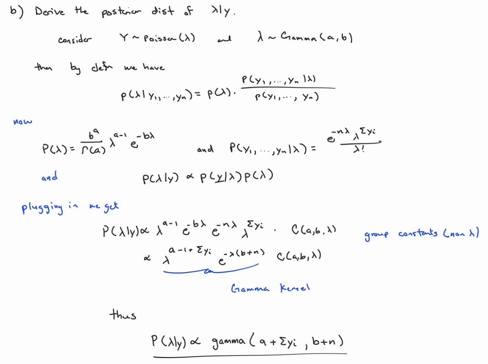
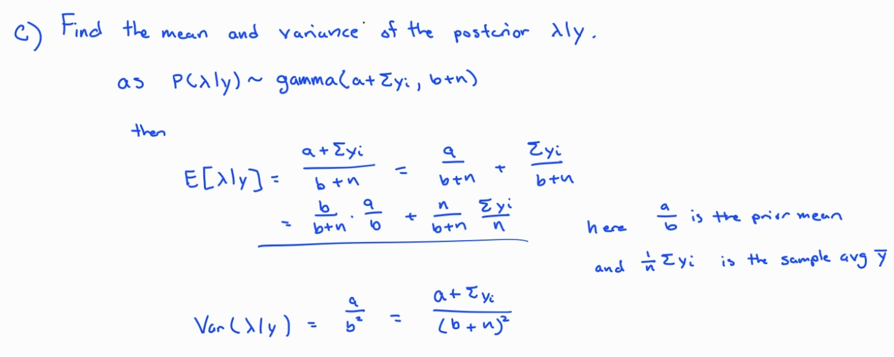
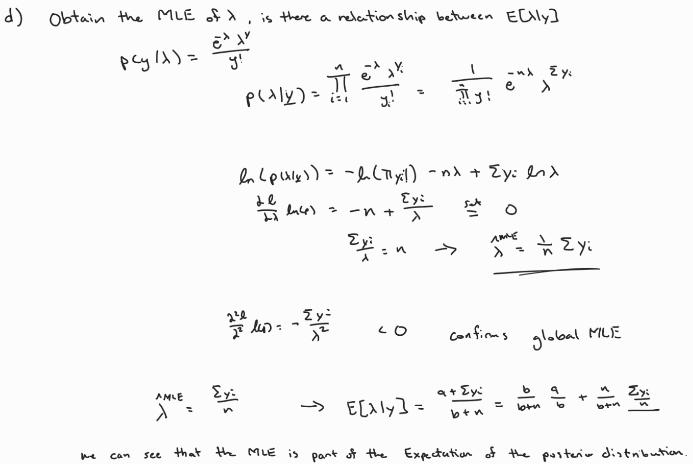
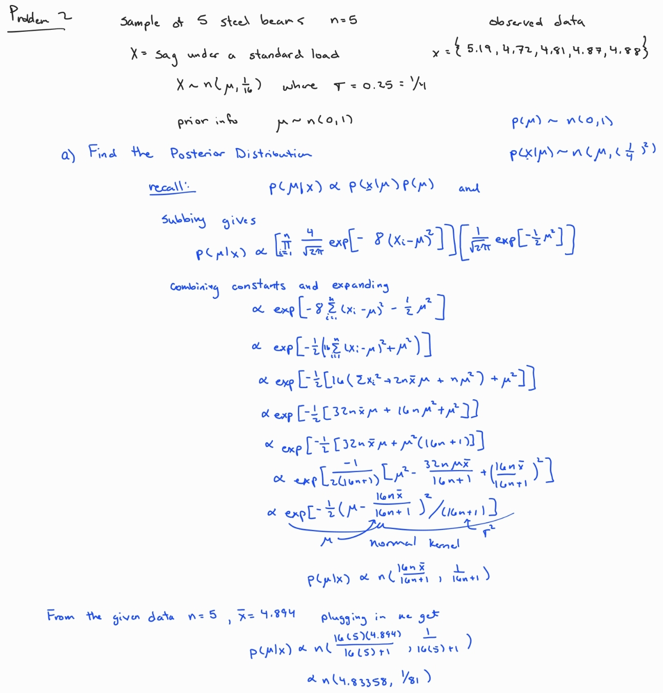

```{r setup, include=FALSE}
knitr::opts_chunk$set(echo = TRUE)
library(tidyverse)
library(ggplot2)
library(MASS)
```

# Problem 1

In this problem we will consider developing a Bayesian model for Poisson data; i.e., our observed data will consist of $Y_{1},...,Y_{n}\stackrel{i.i.d}{\sim} Poisson(\lambda)$. Recall, a random variable Y is said to follow a Poisson distribution, with mean parameter $\lambda$ if its pmf is given by

Note, the Poisson model is often used to analyze count data.

a.  For the Poisson model, identify the conjugate prior. This should be a general class of priors.

    -   Here as Poisson is part of the exponential family, we can see that its conjugate family of priors are Gamma(a,b)

b.  Under the conjugate prior, derive the posterior distribution of $\lambda | y$. This should be a general expression based on the choice of the hyper-parameters specified in your prior.

    {width="556"}

c.  Find the posterior mean and variance of $\lambda | y$ . These should be general expressions based on the choice of the hyper-parameters specified in your prior.

    

d.  Obtain the MLE of $\lambda$. Develop and discuss a relationship that exists between the MLE and posterior mean identified in (c).

    

e.  Write two separate R programs which can be used to both find a$(1-\alpha)100\%$ equal-tailed credible interval and a $(1-\alpha)100\%$ HPD credible interval for the Poisson model. These programs should take as arguments the following inputs: the observed data, prior hyper-parameters, and significance level.

    ```{r Credible Interval}
    # Takes a poisson model with a gamma prior and returns a (1-alpha) credible  
    # interval for the model
    EQCI.poisson <- function(y , a , b, alpha){
      return(qgamma(c(alpha/2, 1-alpha/2),shape = a + sum(y),rate = b + NROW(y)))
    }
    ```

    ```{r HPD Interval}
    # HPD Interval for a given h
    HPD.poisson.h <- function(y ,h = .1, a = 1 , b = 1, plot = F, ...){
        apost <- a + sum(y)
        bpost <- b + NROW(y) #TO ensure we read vectors and dataframes the same
        if (apost >= 1) {
          mode <- (apost - 1)/(bpost)
          dmode <- dgamma(mode, shape = apost, rate = bpost)}
        else return("mode at 0: HPD not implemented yet")
        
        lt <- uniroot(f=function(x){
                     dgamma(x,shape = apost, rate = bpost)/dmode - h},
                     lower=0, upper=mode)$root
        
        ut <- uniroot(f=function(x){ 
                     dgamma(x,shape = apost, rate=bpost)/dmode - h},
                     lower=mode, upper= 100^100)$root
        
        coverage = pgamma(ut, shape = apost, rate = bpost) - 
                   pgamma(lt, shape = apost, rate = bpost)
        if (plot) {
        ld <- seq(0, 3, length=1000)
        plot(ld, dgamma(ld, shape = apost, rate = bpost),
                 t="l", 
                 lty=1,xlab=expression(lambda),
                 ylab="Posterior Density", ...)
        abline(h = h*dmode)
        
        segments(ut,0,ut,dgamma(ut,shape = apost,rate = bpost))
        segments(lt,0,lt,dgamma(lt,shape = apost,rate = bpost))
        
        title(bquote(paste("P(", .(round(lt, 2))," < ", lambda, " < ",             
                           .(round(ut,2)), " | " , y, ") = ",
                           .(round(coverage, 2)))))
        }
        
        return(c(lt,ut,coverage,h))
    }
    #Helper Function 
    Dev.HPD.poisson.h<-function(h, y, alpha){
      cov<-HPD.poisson.h(y, h, plot=F)[3]
      res<-(cov-(1-alpha))^2
      return(res)
    }

    # Returns HPD Interval for poisson prior and gamma posterior at a certain alpha
    HPD_Interval.poisson <- function(y, a , b ,alpha, Plot = F, ...){
      h.final <- optimize(Dev.HPD.poisson.h, c(0,1), y = y, alpha = alpha)$minimum
      
      return(HPD.poisson.h(y, h.final, a, b , Plot))
    }

    ```

    ```{r Test Intervals}
    # Generate test data
    test = rpois(n=30, lambda=3)
    # Interval
    print(paste('Credible:',round(EQCI.poisson(test , 2, 1, .05)[1],4),
                      '-'  ,round(EQCI.poisson(test , 2, 1, .05)[2],4)))

    print(paste('HPD:',round(HPD_Interval.poisson(test ,2, 1,.05)[1],4),
                  '-', round(HPD_Interval.poisson(test ,2, 1,.05)[2],4)))
    # Getting ranges to confirm that HPD is more restrictive
    print(paste('Credible Range:',
                EQCI.poisson(test , 2, 1, .05)[2] - EQCI.poisson(test , 2, 1, .05)[1]))

    print(paste('HPD Range:',
      HPD_Interval.poisson(test ,2, 1,.05)[2] - HPD_Interval.poisson(test ,2, 1,.05)[1]))
    ```

f.  Find a data set which could be appropriately analyzed using the Poisson model. This data set should be of interest to you, and you should discuss, briefly, why the aforementioned model is appropriate; e.g., consider independence, identically distributed, etc. etc. You will also need to provide the source of the data.

    -   I chose the following data set on the number of births per woman in individual contries. This data is appropriate as each individual birth is independent of each other with similar opportunity. I found this data at the following link <https://data.worldbank.org/indicator/SP.DYN.TFRT.IN?end=2019&start=1960&view=chart>

    ```{r include=FALSE}
    # Bicycle_counts
    data <- read_csv("C:/Users/lucio/OneDrive/School/Applied Bayesian Stats/STA-6113-Applied_Bayesian_Stats/Homework_1/Country_Births.csv")
    # Turning into a dataframe
    df <- as.data.frame(data)

    # Dropping rows with NA values
    y<- drop_na(df)
    ```

g.  Analyze the data set you have selected in (e). Provide posterior point estimates of $\lambda$, credible intervals, etc. etc. Your analysis should be accompanied by an appropriate discussion of your findings.

    -   Without any prior info we go ahead and set our prior to gamma(a = 2, b =1). Then our posterior distribution for $\lambda|x$ is given by: Gamma(shape= 831 rate = 2 ). Using the MLE we see that $\lambda$ can be estimated at 3.5. Using the posterior mean it is almost the same at 3.49. Using our HPD we can see that the posterior probability that $\lambda \in [3.2555,3.7301]$ is 95%. For our data this means that for the year 1997, the probability that average number of births per woman is between $[3.2555,3.7301]$ is 95%.

    ```{r}
    #Specifically looking at the year 1997
    y97 <- y['1997']
    # Calculating the posterior
    apost <- 2 + sum(y97, na.rm = TRUE)
    bpost <- 1 + NROW(y97)
    print(paste("Posterior Distribution: Gamma(shape=",apost,'rate =',bpost,')'))

    # We calculate the alpha = .05 credible and HPD intervals
    print(paste('Credible Interval:',round(EQCI.poisson(y97 , 2, 1, .05)[1],4),
                      '-'  ,round(EQCI.poisson(y97 , 2, 1, .05)[2],4)))

    print(paste('HPD Interval:',round(HPD_Interval.poisson(y97 ,2, 1,.05)[1],4),
                  '-', round(HPD_Interval.poisson(y97 ,2, 1,.05)[2],4)))
    # Calculating the MLE of Lambda and then the posterior mean
    sprintf('MLE: %.2f',mean(y97$`1997`))
    sprintf('Posterior Mean: %.2f',(apost/bpost))
    ```

# Problem 2

An engineer takes a sample of 5 steel I beams from a batch and measures the amount (X) they sag under a standard load. The amounts in mm are $5.19, 4.72, 4.81, 4.87, 4.88$. For this data set, it is known that the sag is $normal (\mu, \sigma^2)$, where the standard deviation $\sigma = .25$ is known. Use a $normal (0, 1)$ prior for $\mu$.

a.  Find the posterior distribution of $\mu$. Show all work!

    -   The posterior distribution is given by $n(4.83358,\frac{1}{81})$

    

b.  Draw the density of the posterior and prior distribution of $\mu$ in the same figure.

    ```{r}
    # posterior and prior
    par(mar = c(4, 4, 1, 1))
    theta <- seq(-8, 8, by = 0.01)
    plot(theta, dnorm(theta, mean = 4.83358,sd = sqrt(1/81)),t="l", lty=1,
         ylab="Posterior Density",
         xlab=expression(theta), col = 'dark red')
    lines(theta, dnorm(theta,0,1), lty=2, col = 'dark blue')
    legend(-8,3.5, c("Posterior", "Prior"), lty=c(1,2))

    ```
