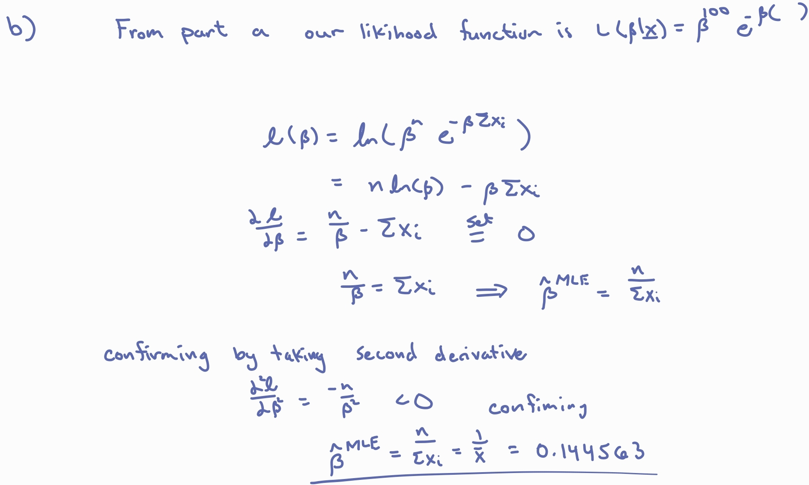
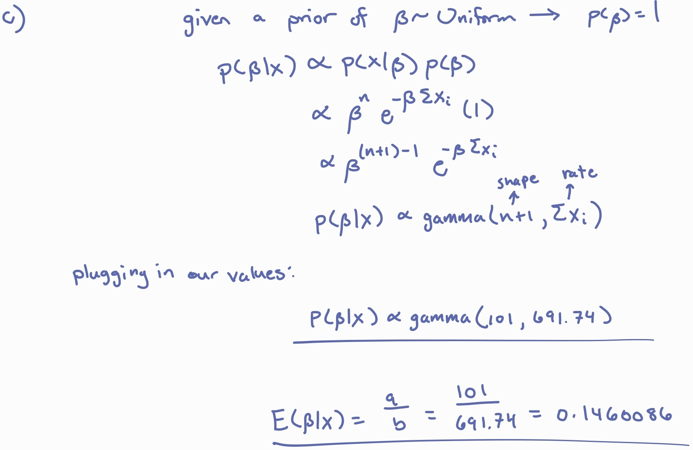
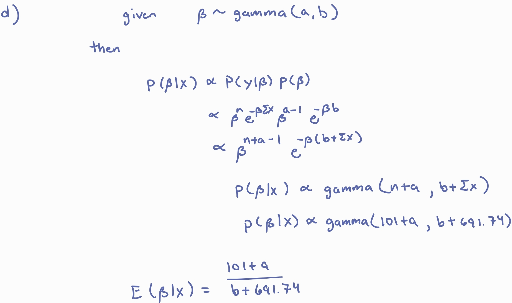

```{r setup, include=FALSE}
knitr::opts_chunk$set(echo = TRUE)
library(tidyverse)
library(ggthemes)
```

# Problem 1

## Rules of Craps

-   Two fair dice are rolled. If the sum is 7 or 11, the player wins immediately; if the sum is 2, 3, or 12, the player loses immediately. Otherwise the sum becomes the *point*.

-   The two dice continue to be rolled until either a sum of 7 is rolled (in which case the player loses) or a sum equal to the *point* is rolled (in which case the player wins).

## Simulation

```{r Craps}
# Helper function that simulates the craps game
# Returns 1 if players wins and 0 if he loses.
craps <- function(){
	first.roll = sample(1:6, 1) + sample(1:6,1)
	if(first.roll %in% c(2,3,12)){
		return(0)
	} 
	else if(first.roll %in% c(7,11)){
		return(1)
	} 
	else{
		point = first.roll
		next.roll = sample(1:6, 1) + sample(1:6,1)
		while(next.roll != point && next.roll != 7){
			next.roll = sample(1:6, 1) + sample(1:6,1)
		}
		if(next.roll == point){
			return(1)
		}
		return(0)
  }
}
```

```{r Monte Carlo Simulation}

sims = 500000	# Number of times simulated
n = 10		# Number of games to play
i.bet = 10	# Initial bet of 10 dollars
winnings = rep(0, sims)

for(t in 1:sims){
	bet = i.bet
	wins_sim = 0
	for(i in 1:n){
		result = craps()
		if(result == 0){
			wins_sim = wins_sim - bet
			bet = 2*bet
		}
		if(result == 1){
			wins_sim = wins_sim + bet
			bet = i.bet
		}
	}
	winnings[t] = wins_sim
}
hist(winnings)
```

# Problem 2

A manufacturer of microwave ovens is trying to determine the length of warranty period it should attach to its magnetron tube, the most critical component in the oven. Preliminary testing has shown that the [**length of life (in years), x**]{.ul}, of a magnetron tube has an [**exponential distribution probability distribution with a rate parameter β**]{.ul}. The manufacturer has collected *100 observations* about the length of life of magnetron tubes (data set is available on blackboard).

```{r}
oven<- read_table('Manufacturer.txt.txt')
```

a.  Write down the likelihood function of rate parameter $\beta$ and draw the likelihood function of $\beta$ based on the given data set.

    $$
    L(\beta|x) = \prod_{i=1}^{100}{\beta e^{-\beta x_i}}=\beta^{100} e^{-\beta \sum_{i=1}^{100}{x_i}} \\
    L(\beta|x) = \beta^{100}e^{-691.74\beta}  
    $$

```{r}
a1 = length(oven$x)
b1 = sum(oven$x)
Lx <- function(x){
  return ((x^a1)*exp(-x*b1))
}
ggplot(data.frame(x = c(0,1) ), aes(x = x )) + 
  stat_function(fun = Lx) +
  labs(title = 'Likelihood Function',
       x = expression(beta),
       y = bquote(paste('L(',beta,'|x)'))) +
  theme_fivethirtyeight() +
  theme(axis.title = element_text())
```

b.  Based on part a) and then find the likelihood estimate (MLE) of $\beta$.

    

c.  Based on the uniform prior: p($\beta$) = 1, find the posterior distribution of $\beta$ and then find the posterior mean of $\beta$. Draw the posterior density function of $\beta$ using R-software.

    

```{r}
a = length(oven$x) + 1
b = sum(oven$x)
fx <- function(x){
  return ((b^a/gamma(a))*x^(a-1)*exp(-b*x))
}
ggplot(data.frame(x = c(0,1) ), aes(x = x )) + 
  stat_function(fun = fx) +
  labs(title = 'Posterior Distribution',
       subtitle = bquote(paste('P(',beta,'|x)=Gamma(101,691.74)')),
       x = expression(beta),
       y = bquote(paste(beta,'|',x))) +
  theme_fivethirtyeight() +
  theme(axis.title = element_text())
```

d.  Based on the gamma distribution $p(\beta) \propto \beta^{a -1}exp(-\beta b)$, find the posterior distribution of $\beta$ and then find the posterior mean of $\beta$.

    

e.  What is a 95% Bayesian credible interval for the average length of life of a magnetron tube under the ***uniform*** prior on part c)?

```{r}
qgamma(c(0.025, 0.975),shape = a ,rate = b )

```

f.  What is the posterior probability that the average length of life of a magnetron tube is less than 10 years under the ***uniform*** prior on part c)?

g.  Under the uniform prior, find Bayesian credible interval of $\beta$ and Bayesian credible interval $1/\beta$? Is Bayesian credible interval invariant?
